            SCD-TYPES
SCD = Slowly Changing Dimension
It’s how we handle changes in data over time in a dimension table (like customer info, product info).
How many SCD Types are there?
Commonly used SCD types:
Type 0 – No change allowed

Type 1 – Overwrite

Type 2 – Full history

Type 3 – Limited history

In real projects, Type 1, Type 2, and Type 3 are the most important and widely used.

SCD Type 0 — No Change Allowed
Definition:

SCD Type 0 is used when dimension data is considered permanent and unchangeable. Once a record is inserted into the dimension table, it is never updated, even if the source system later provides a different value. This type assumes that the attribute is fixed for the lifetime of the record and does not require any correction or update.
In this approach, the data warehouse deliberately ignores all future changes for those attributes. This ensures data stability and prevents accidental modifications to critical reference data. SCD Type 0 is usually applied only to attributes that are guaranteed not to change.

Typical Usage:
Date of Birth
Employee Hire Date
Product Launch Date
Key Point:
Data is inserted once and remains the same forever.

SCD Type 1 
Definition:

SCD Type 1 handles changes by overwriting the existing value in the dimension table with the new value from the source system. In this method, no historical data is preserved. The old value is completely replaced and lost once the update happens.
This type is best suited for situations where historical values are not meaningful or not required, such as correcting data errors, fixing spelling mistakes, or updating inaccurate information. The focus is always on storing the most current and accurate data.
SCD Type 1 is simple to implement and requires less storage because the table does not grow in size due to changes. However, the trade-off is that past values cannot be recovered for reporting or auditing purposes.

Typical Usage:
Name spelling corrections
Email corrections
Phone number formatting fixes

Key Point:
Always shows the latest value, history is discarded.

Example:
      
SCD Type 1 — Overwrite (No history)

What it does: Updates the old value with the new value. No history is kept.
Use case: When you don’t need to track changes, only the latest info matters.

Example: Customer changes email.

Customer_ID	Name	Email
1	Alice	alice@gmail.com

Change: Alice changes email to alice@yahoo.com.

After Type 1 update:
Customer_ID	Name	Email
1	Alice	alice@yahoo.com

Conclusion: Old email is gone.

SCD Type 2 — Full Historical Tracking
Definition:

SCD Type 2 is the most powerful and widely used SCD technique. It manages changes by creating a new row in the dimension table whenever an attribute changes, while preserving the old record as historical data. Each version of the record represents the data as it was at a specific point in time.
To support this, additional columns such as start date, end date, current flag, or version number are used. These columns allow the system to identify which record is currently active and which records are historical.
SCD Type 2 enables complete time-based analysis, such as understanding how customer details, employee roles, or product prices evolved over time. This method is essential when businesses need auditability, compliance, or trend analysis.
Although this approach increases storage usage and complexity, it provides the most accurate historical representation of data.

Typical Usage:

Customer address history
Employee department changes
Product price changes

Key Point:
Every change is preserved as a new record.

SCD Type 2 — Add new row (Full history)

What it does: Keeps the old record and adds a new record with new data. Often uses start_date and end_date or current_flag to track active record.
Use case: When you need full history of changes.

Example: Same customer changes email.

Customer_ID	Name	Email	Start_Date	End_Date	Current_Flag						
1	Alice	alice@gmail.com	2025-01-01	2025-12-20	N						
1	Alice	alice@yahoo.com	2025-12-21	NULL	Y						

Conclusion: Old email is kept, new email is added.

SCD Type 3 — Limited Historical Tracking
Definition:

SCD Type 3 manages changes by storing the current value and a limited number of previous values in separate columns within the same row. Unlike Type 2, it does not create new rows for each change. Instead, it updates existing columns to reflect the new and previous values.
This type is useful when only recent history is needed, such as comparing current and previous states. However, it does not support full historical tracking, as older values are overwritten once new changes occur.
SCD Type 3 strikes a balance between simplicity and limited historical insight. It requires additional columns but avoids table growth. However, it is less flexible than Type 2 and unsuitable for detailed historical reporting.
Typical Usage:
Current and previous department
Current and last product category
Current and previous sales region

Key Point:

Stores only a small amount of history.

SCD Type 3 — Add new column (Partial history)

What it does: Keeps only limited history (usually previous value) in new columns. No new row.
Use case: When you only care about current and previous value.

Example: Track old email.

Customer_ID	Name	Current_Email	Previous_Email
1	Alice	alice@yahoo.com	alice@gmail.com

Conclusion: Only the previous email is remembered, older history is gone.

SCD TYPE 1 (Overwrite – No History)
QUERIES:

Create Dimension Table

CREATE OR REPLACE DATABASE SCD_DEMO;
USE DATABASE SCD_DEMO;

CREATE OR REPLACE SCHEMA DIM;
USE SCHEMA DIM;

Create Dimension Table

CREATE OR REPLACE TABLE CUSTOMER_SCD1 (
    CUSTOMER_ID INT,
    CUSTOMER_NAME STRING,
    EMAIL STRING
);

Image

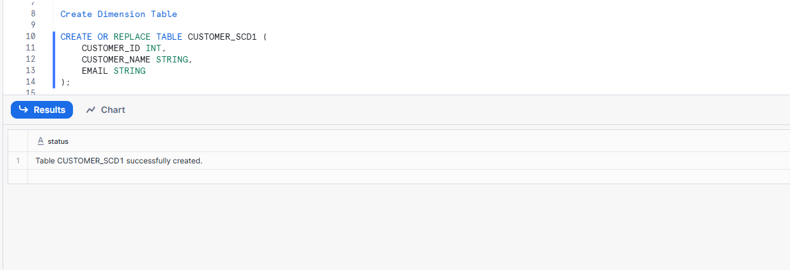

Insert Initial Data

INSERT INTO CUSTOMER_SCD1 VALUES
(1, 'Alice', 'alice@gmail.com');

Image
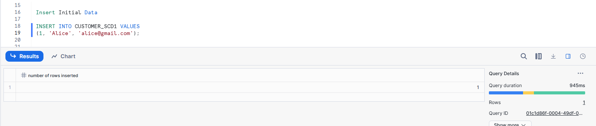

Change happens (email updated)

UPDATE CUSTOMER_SCD1
SET EMAIL = 'alice@yahoo.com'
WHERE CUSTOMER_ID = 1;

Image

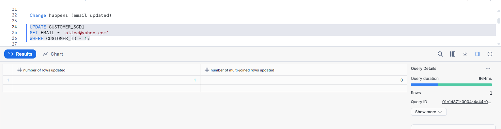

Result

SELECT * FROM CUSTOMER_SCD1;

Image

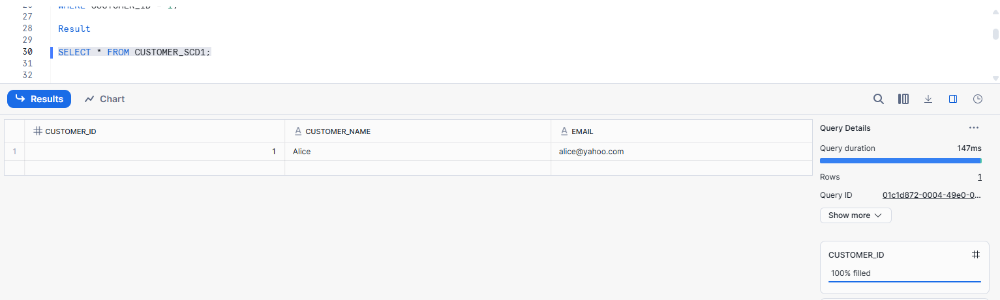

✔ Old value is lost permanently

SCD TYPE 2 (Add New Row – Full History)

CREATE OR REPLACE TABLE CUSTOMER_SCD2 (
    CUSTOMER_SK INT AUTOINCREMENT,   -- Surrogate key
    CUSTOMER_ID INT,
    CUSTOMER_NAME STRING,
    EMAIL STRING,
    START_DATE DATE,
    END_DATE DATE,
    CURRENT_FLAG STRING
);

Image

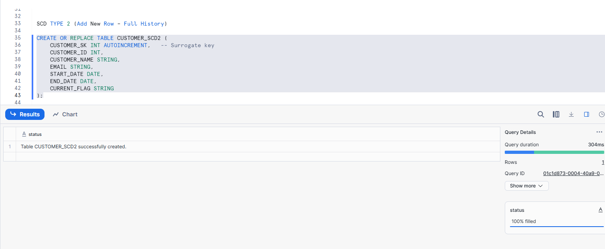

Insert Initial Record

INSERT INTO CUSTOMER_SCD2
(CUSTOMER_ID, CUSTOMER_NAME, EMAIL, START_DATE, END_DATE, CURRENT_FLAG)
VALUES
(1, 'Alice', 'alice@gmail.com', CURRENT_DATE(), NULL, 'Y');

Image

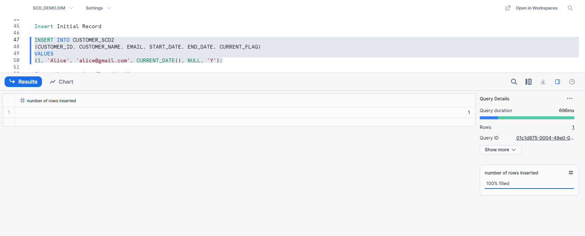

Change happens (email updated)

UPDATE CUSTOMER_SCD2
SET END_DATE = CURRENT_DATE() - 1,
    CURRENT_FLAG = 'N'
WHERE CUSTOMER_ID = 1
  AND CURRENT_FLAG = 'Y';

Image

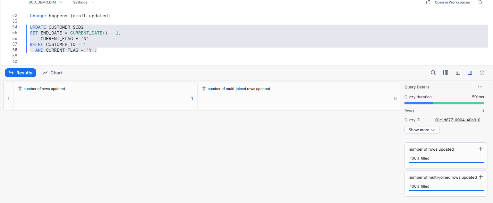

  Insert new record

  INSERT INTO CUSTOMER_SCD2
(CUSTOMER_ID, CUSTOMER_NAME, EMAIL, START_DATE, END_DATE, CURRENT_FLAG)
VALUES
(1, 'Alice', 'alice@yahoo.com', CURRENT_DATE(), NULL, 'Y');

Image

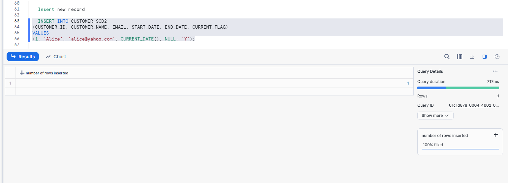

Result

SELECT * FROM CUSTOMER_SCD2 ORDER BY CUSTOMER_SK;

Image

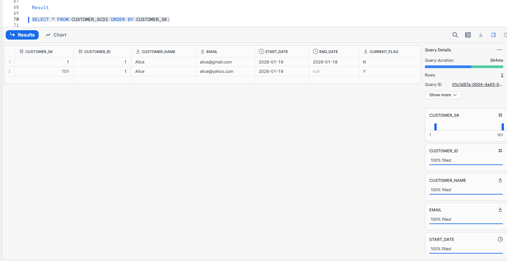

✔ Full history is preserved

SCD TYPE 3 (Limited History – Extra Column)

Create Dimension Table

CREATE OR REPLACE TABLE CUSTOMER_SCD3 (
    CUSTOMER_ID INT,
    CUSTOMER_NAME STRING,
    CURRENT_EMAIL STRING,
    PREVIOUS_EMAIL STRING
);
Image

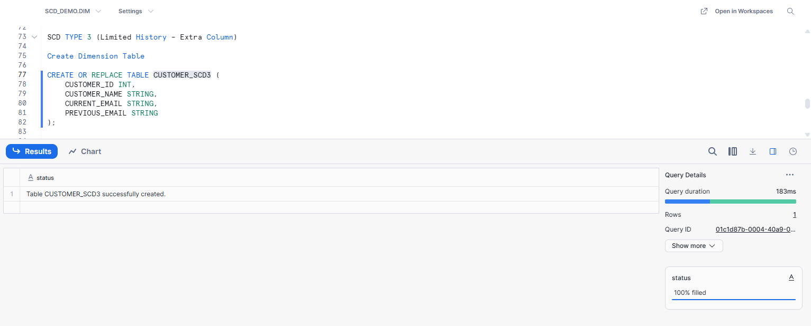

Insert Initial Data

INSERT INTO CUSTOMER_SCD3 VALUES
(1, 'Alice', 'alice@gmail.com', NULL);

Image

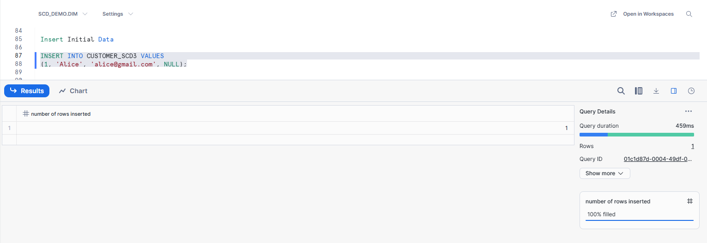

Change happens (email updated)

UPDATE CUSTOMER_SCD3
SET PREVIOUS_EMAIL = CURRENT_EMAIL,
    CURRENT_EMAIL = 'alice@yahoo.com'
WHERE CUSTOMER_ID = 1;

Image

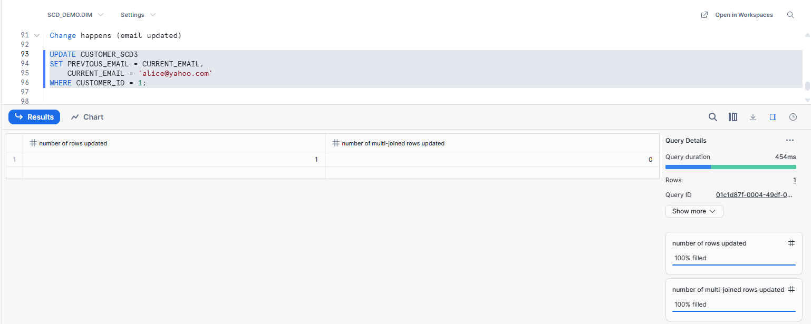

Result

SELECT * FROM CUSTOMER_SCD3;

Image

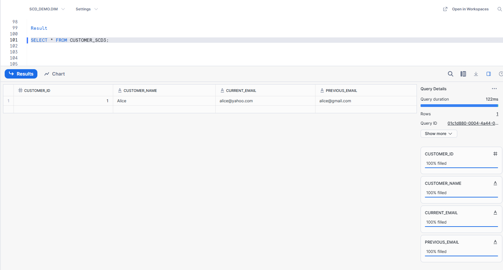

✔ Only current + previous value stored
✔ Older history is lost

SCD1, SCD2, SCD3 – Outputs

SCD1-    (Overwrite – No History)
Image

 

SCD2-     (Add New Row – Full History)
Image

 

SCD3-  (Limited History – Extra Column)

Image

 

